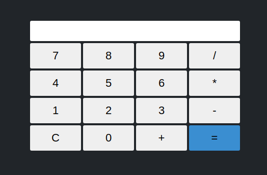

## Projeto simples de uma calculadora utilizando Javascript, HTML5, CSS3 e NodeJS.

Neste projeto foi desenvolvido o estudo do zero para implementação do express, integrando de forma estática as funcionalidades Javascript e os estilos CSS.

### Teste em seu Computador!

Como requisito neste projeto, deve haver instalado na maquina em questão os seguinte:

* [NodeJS](https://nodejs.org/en/)
* [Git](https://git-scm.com/downloads)

e uma IDE, como estou usando o VSCode deixo também um link para download:

* [VsCode](https://code.visualstudio.com/)

Feito e instalação das ferramentas utilizadas nesse projeto, siga os passo abaixo para testar o projeto em questão:

1. Abra a IDE escolhida, no meu caso o VsCode
2. Abra um terminal na pasta do projeto, no caso do VsCode localizado na barra de tarefas, descrito como `Terminal`, `new Terminal` OU digite `CTRL + ALTgr + j`
3. [Clone](https://docs.github.com/pt/github/creating-cloning-and-archiving-repositories/cloning-a-repository#:~:text=10%2C%20done.-,Clonar%20um%20reposit%C3%B3rio%20no%20GitHub%20Desktop,Desktop%20para%20concluir%20o%20clone.) o projeto em questão.
4. Digite `cd calculadora-JavaScript-CSS3-HTML5`
5. Instale as dependências necessárias rodando no terminal dentro da pasta clonada: 
    
    `npm install express`

    `npm install body-parser`

Se tudo correr bem digite `node app.js`, abra o navegador de preferência e digite na url [localhost:3000](http://localhost:3000)

Logo verá nossa aplicação rodando! Caso tenha alguma opinião em relação a melhora do processo ou implementação de algo (que com certeza haverá rsrs), deixe sua sugestão sem medo, será muito bem-vinda. Afinal sou somente um aprendiz e quero progredir com quem sabe. 

#### Obrigado!
